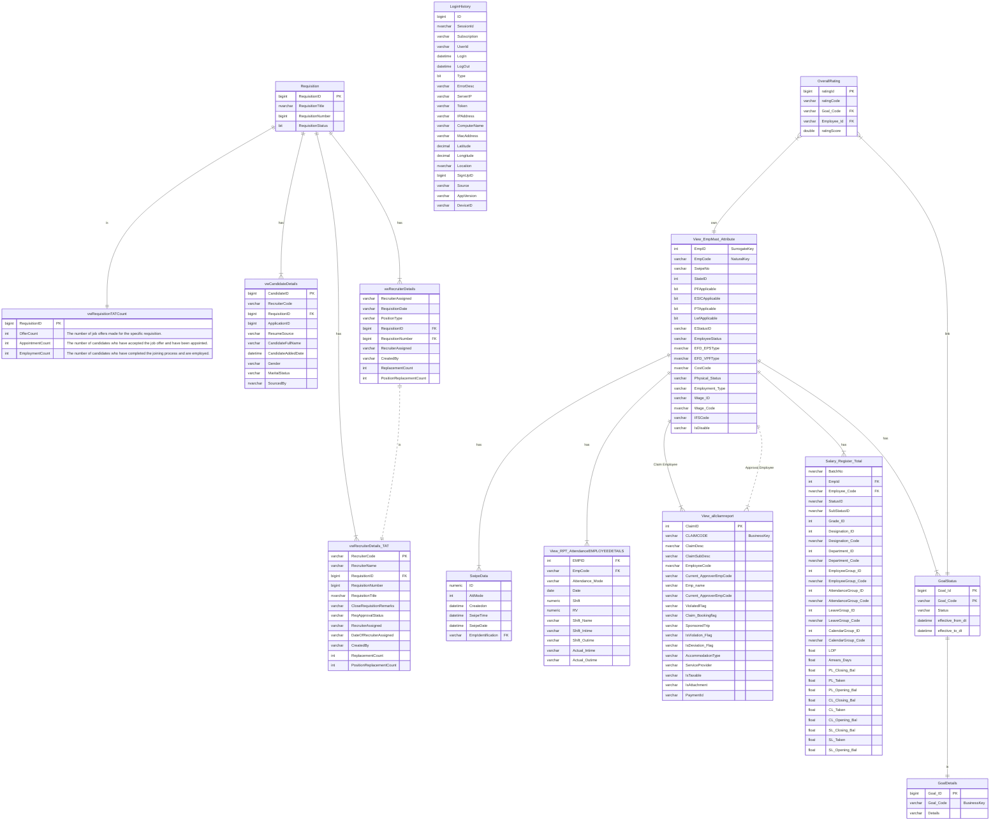

```mermaid
erDiagram
    Requisition {
        bigint RequisitionID PK
        nvarchar RequisitionTitle
        bigint RequisitionNumber
        bit RequisitionStatus
    }

    vwRequisitionTATCount {
        bigint RequisitionID PK
        int OfferCount "The number of job offers made for the specific requisition."
        int AppointmentCount "The number of candidates who have accepted the job offer and have been appointed."
        int EmploymentCount "The number of candidates who have completed the joining process and are employed."
    }

    vwCandidateDetails {
        bigint CandidateID PK
        varchar RecruiterCode
        bigint RequisitionID FK
        bigint ApplicationID
        varchar ResumeSource
        varchar CandidateFullName
        datetime CandidateAddedDate
        varchar Gender
        varchar MaritalStatus
        nvarchar SourcedBy
    }

    vwRecruiterDetails {
        varchar RecruiterAssigned
        varchar RequisitionDate
        varchar PositionType
        bigint RequisitionID FK
        bigint RequisitionNumber FK
        varchar RecruiterAssigned
        varchar CreatedBy
        int ReplacementCount
        int PositionReplacementCount
    }

    vwRecruiterDetails_TAT {
        varchar RecruiterCode PK
        varchar RecruiterName
        bigint RequisitionID FK
        bigint RequisitionNumber
        nvarchar RequisitionTitle
        varchar CloseRequisitionRemarks
        varchar ReqApprovalStatus
        varchar RecruiterAssigned
        varchar DateOfRecruiterAssigned
        varchar CreatedBy
        int ReplacementCount
        int PositionReplacementCount
    }

    Requisition ||--|{ vwCandidateDetails: has
    Requisition ||--|{ vwRecruiterDetails: has
    Requisition ||--|{ vwRecruiterDetails_TAT: has
    vwRecruiterDetails ||..|| vwRecruiterDetails_TAT: is
    Requisition ||--|| vwRequisitionTATCount: is

    LoginHistory {
        bigint ID
        nvarchar SessionId
        varchar Subscription
        varchar UserId
        datetime LogIn
        datetime LogOut
        bit Type
        varchar ErrorDesc
        varchar ServerIP
        varchar Token
        varchar IPAddress
        varchar ComputerName
        varchar MacAddress
        decimal Latitude
        decimal Longitude
        nvarchar Location
        bigint SignUpID
        varchar Source
        varchar AppVersion
        varchar DeviceID
    }

    SwipeData {
        numeric ID
        int AttMode
        datetime Createdon
        datetime SwipeTime
        datetime SwipeDate
        varchar EmpIdentification FK
    }

    View_RPT_AttendanceEMPLOYEEDETAILS {
        int EMPID FK
        varchar EmpCode FK
        varchar Attendance_Mode
        date Date
        numeric Shift
        numeric RV
        varchar Shift_Name
        varchar Shift_Intime
        varchar Shift_Outime
        varchar Actual_Intime
        varchar Actual_Outime
    }

    View_EmpMast_Attribute {
        int EmpID "SurrogateKey"
        varchar EmpCode "NaturalKey"
        varchar SwipeNo
        int StateID
        bit PFApplicable
        bit ESICApplicable
        bit PTApplicable
        bit LwfApplicable
        varchar EStatusID
        varchar EmployeeStatus
        nvarchar EFD_EPSType
        nvarchar EFD_VPFType
        nvarchar CostCode
        varchar Physical_Status
        varchar Employment_Type
        varchar Wage_ID
        nvarchar Wage_Code
        varchar IFSCode
        varchar IsDisable
    }

    View_allcliamreport {
        int ClaimID PK
        varchar CLAIMCODE "BusinessKey"
        nvarchar ClaimDesc
        varchar ClaimSubDesc
        nvarchar EmployeeCode
        varchar Current_ApproverEmpCode
        varchar Emp_name
        varchar Current_ApproverEmpCode
        varchar ViolatedFlag
        varchar Claim_Bookingflag
        varchar SponsoredTrip
        varchar IsViolation_Flag
        varchar IsDeviation_Flag
        varchar AccommodationType
        varchar ServiceProvider
        varchar IsTaxable
        varchar IsAttachment
        varchar PaymentId
    }

    Salary_Register_Total {
        nvarchar BatchNo
        int EmpId FK
        nvarchar Employee_Code FK
        nvarchar StatusID
        nvarchar SubStatusID
        int Grade_ID
        int Designation_ID
        nvarchar Designation_Code
        int Department_ID
        nvarchar Department_Code
        int EmployeeGroup_ID
        nvarchar EmployeeGroup_Code
        int AttendanceGroup_ID
        nvarchar AttendanceGroup_Code
        int LeaveGroup_ID
        nvarchar LeaveGroup_Code
        int CalendarGroup_ID
        nvarchar CalendarGroup_Code

        float LOP
        float Arrears_Days
        float PL_Closing_Bal
        float PL_Taken
        float PL_Opening_Bal
        float CL_Closing_Bal
        float CL_Taken
        float CL_Opening_Bal
        float SL_Closing_Bal
        float SL_Taken
        float SL_Opening_Bal
    }

    View_EmpMast_Attribute ||--|{ SwipeData: has
    View_EmpMast_Attribute ||--|{ View_RPT_AttendanceEMPLOYEEDETAILS: has
    View_EmpMast_Attribute ||--|{ View_allcliamreport: "Claim Employee"
    View_EmpMast_Attribute ||..|{ View_allcliamreport: "Approval Employee"
    View_EmpMast_Attribute ||--|{ Salary_Register_Total: "has"

    GoalStatus {
        bigint Goal_Id PK
        varchar Goal_Code PK
        varchar Status
        datetime effective_from_dt
        datetime effective_to_dt
    }

    GoalDetails {
        bigint Goal_ID PK
        varchar Goal_Code "BusinessKey"
        varchar Details
    }

    OverallRating {
        bigint ratingId PK
        varchar ratingCode
        varchar Goal_Code FK
        varchar Employee_Id FK
        double ratingScore
    }

    View_EmpMast_Attribute ||--|{ GoalStatus: has
    GoalStatus ||--|| GoalDetails: is
    OverallRating }|--|| View_EmpMast_Attribute: own
    OverallRating }|--|| GoalStatus: link
```